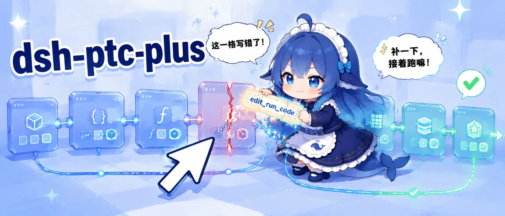
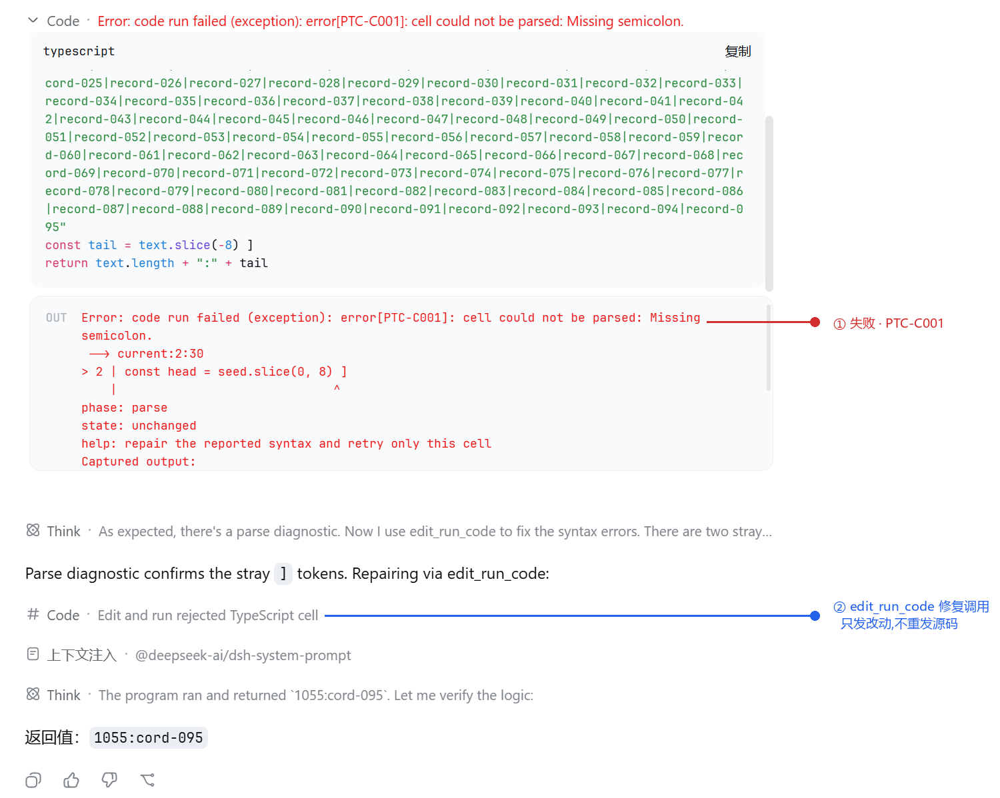

# dsh-ptc-plus

English | [简体中文](README.zh.md)



A session-bound REPL and transport-recovery layer for [DeepSeek Harness](https://github.com/deepseek-ai/deepseek-harness) TypeScript PTC mode.

> [!NOTE]
> This is an unofficial, independently maintained community plugin. It is not affiliated with or endorsed by DeepSeek or the DSH project.

> [!IMPORTANT]
> PTC Plus is designed first for DSH's `danger-full-access` profile. It preserves direct Node.js and operating-system access instead of adding another sandbox. A narrower DSH tool profile only reduces the native tools supplied to the request; it does not by itself confine ambient Node/OS access. Use PTC Plus only where this authority is acceptable.

PTC Plus lets the model extend one live program across consecutive `run_code` cells, reuse earlier bindings, call the current DSH typed capabilities, and recover common PTC mode transport mistakes without making ordinary tasks noisier.



In this DSH Web session, `edit_run_code` repaired a one-character error in a rejected cell and ran it without resending the full source.

## What the Model Gets

- **Persistent cells**: variables, functions, modules, and computed values remain available to later `run_code` calls in the same session.
- **Native typed capabilities**: the cell receives the DSH `tools.*` bindings already authorized for the current request; PTC Plus does not copy their schemas, results, approval rules, or dispatch logic.
- **Silent transport recovery**: a known top-level native tool call emitted in strict PTC mode is lowered to an equivalent `run_code` cell before it is persisted. Valid calls keep the same DSH validation and execution path and do not add a warning or retry turn.
- **Local repair for rejected source**: `edit_run_code` replaces one exact fragment in the latest eligible pre-execution rejection and immediately runs the repaired cell, so a small syntax mistake does not require the model to regenerate a long program.
- **Durable and live recovery**: deterministic work and recorded capability results can be replayed after a worker restart; direct Node or operating-system input remains usable in the live process and is marked `volatile` instead of being falsely replayed.
- **Program-native exploration and control**: `capabilities.tree/find/inspect`, `repl.state`, and isolated `code.run` are available inside cells without introducing a generic reflection bus.

Successful ordinary cells produce no PTC warning or note. The first transition to `volatile` is recorded in the journal but is also silent; diagnostics are reserved for actionable failures and cold-recovery loss.

## Measured Results

A paired A/B run used `opencode-go/deepseek-v4-flash`, DSH `0.1.0-rc.8`, strict PTC mode, and `danger-full-access`: 7 ordinary task families, 2 replicates, and 28 sessions. The plugin setting was the only difference between each pair.

| Metric | PTC Plus | Baseline |
| --- | ---: | ---: |
| Blind-review score | **105 / 126** | 91 / 126 |
| Model calls | **57** | 71 |
| Top-level tool-call errors | **1** | 19 |
| Deterministic task outcomes | **10 pass / 0 fail / 4 unscored** | 9 pass / 1 fail / 4 unscored |
| PTC warnings | 0 | 0 |
| Token traffic per session (median) | **43,509.5** | 48,916.5 |
| Paired sessions with lower traffic | **11 / 14** | 3 / 14 |

Token traffic is input + cache read + cache write + output tokens. The table reports this run, not a general benchmark; it covers one model and two replicates per task.

## Installation

Requirements:

- Node.js `^22.19.0 || >=24.0.0`;
- an existing DSH installation with TypeScript PTC mode;
- DSH CLI `0.1.0-rc.8` is the currently verified integration version.

Install into the profile that actually runs your DSH surface. Replace `<profile>` with that profile name; do not assume that a profile named `default` is active.

### npm

For a release available from the npm registry, install it with:

```sh
dsh plugin --profile <profile> add dsh-ptc-plus@0.1.0
dsh --profile <profile> --dump-config
```

If the selected version is not available from the registry, use a pinned Git revision, a source checkout, or a tarball.

### Pinned Git revision

The package ships runnable JavaScript, so a Git install does not require a build script. Replace `COMMIT_SHA` with a reviewed commit:

```sh
dsh plugin --profile <profile> add github:muyuanjin/dsh-ptc-plus#COMMIT_SHA
dsh --profile <profile> --dump-config
```

### Source checkout

```sh
git clone https://github.com/muyuanjin/dsh-ptc-plus.git
cd dsh-ptc-plus
dsh plugin --profile <profile> add .
dsh --profile <profile> --dump-config
```

When the DSH CLI itself runs from a `deepseek-harness` source checkout, invoke the same operation through its launcher:

```sh
pnpm dsh plugin --profile <profile> add /absolute/path/to/dsh-ptc-plus
pnpm dsh --profile <profile> --dump-config
```

### Tarball

From a source checkout:

```sh
npm pack
dsh plugin --profile <profile> add ./dsh-ptc-plus-0.1.0.tgz
dsh --profile <profile> --dump-config
```

Windows development checkouts can instead use the content-addressed snapshot installer. Its argument is the target profile and defaults to `web` when omitted:

```bat
scripts\install-dev.cmd headless
```

### DSH Desktop

On Windows or macOS, choose **Open DSH Terminal** from the Desktop tray. Bare plugin commands in that terminal target the active profile, so install the registry package or an absolute tarball path without guessing its profile name:

```sh
dsh plugin add dsh-ptc-plus@0.1.0
dsh --dump-config
```

If the selected version is not available from the registry, install an absolute tarball path from this terminal instead:

```sh
dsh plugin add /absolute/path/to/dsh-ptc-plus-0.1.0.tgz
dsh --dump-config
```

Restart DSH Desktop after installation. Linux Desktop is not a current DSH Desktop release target; use DSH CLI/Web on Linux.

## Usage

There is no separate command or UI to enter the REPL. Use DSH PTC mode normally; each direct `run_code` call becomes the next cell in the session environment.

```ts
// Cell 1
const rows = ['{"id":1}', '{"id":2}']
function parseRow(line) {
  return JSON.parse(line)
}
```

```ts
// Cell 2
const records = rows.map(parseRow)
return records.reduce((sum, record) => sum + record.id, 0)
```

The second cell directly uses `rows` and `parseRow`; their source is not copied into another tool argument or regenerated by the model.

Native DSH tools remain available through the typed SDK inside the cell:

```ts
const roots = await capabilities.tree()
const matches = await capabilities.find('session')
return capabilities.inspect({
  symbols: matches.slice(0, 8).map(item => item.symbol),
  budget: 8,
})
```

`capabilities.*` is read-only metadata. Capability calls remain on the typed `tools.*` members declared by DSH.

Strict PTC mode exposes `run_code` followed by `edit_run_code` on every request. `edit_run_code` accepts `old_string` and `new_string`, requires one exact match, and applies only to the latest eligible cell rejected before execution. It cannot retry runtime failures or cells with possible effects.

## Compatibility and Permissions

| Component | Current contract |
| --- | --- |
| DeepSeek Harness | Verified with CLI `0.1.0-rc.8`; prerelease upgrades require revalidation |
| PTC runtime | DSH TypeScript PTC mode; cells currently use modern JavaScript syntax |
| Node.js | `^22.19.0 || >=24.0.0` |
| CLI/Web platforms | Windows DSH `0.1.0-rc.8` profile install and Linux package runtime verified locally; macOS is a CI target |
| DSH Desktop | Uses the active profile on current Windows/macOS releases; restart after installation |
| Recommended permission mode | `danger-full-access` |
| Client UI | None; the product surface is the normal DSH conversation and PTC mode cards |

`danger-full-access` is the first-class experience. The model can combine DSH native typed tools with familiar Node.js filesystem, process, network, child-process, and ecosystem APIs when the active DSH profile and operating system permit them.

DSH remains the owner of native-tool scope, policy, approval, cancellation, sandboxing, and scheduling. PTC Plus does not implement a second cross-platform permission system, shell registry, or tool adapter table. Direct Node and operating-system access is governed by the worker process and host OS, not by a narrower DSH tool list.

Other permission profiles degrade to the capabilities actually present in the request. Missing native capabilities fail through their normal contract, and direct ambient access may be unavailable or restricted by the host. The plugin does not simulate missing authority.

The worker thread isolates the REPL lifecycle; it is not a malicious-code security sandbox.

## Runtime Model

Each top-level `run_code` is parsed as the body of an async function using modern JavaScript syntax. Top-level bindings survive across cells, block scope and top-level `await` work normally, and `return` produces the cell result.

The default loose binding mode lets a complete top-level `const` or `let` declarator replace existing names. New declarators create bindings. Mixed new/existing destructuring, function/class redeclaration, or any redeclaration in strict mode is rejected before execution.

All capability namespaces are leased to one cell. Captured `tools`, `capabilities`, `repl`, `code`, or member functions expire when that cell ends, preventing stale authority from being retained in later cells.

### Durable and Volatile State

| State | Live process | Cold recovery |
| --- | --- | --- |
| `durable` | Continues normally | Replays source and recorded capability results without redispatching effects |
| `volatile` | Keeps the complete live REPL | Skips the volatile suffix and restores the last durable frontier |

Deterministic computation, supported Node modules, and settled program-binding results can advance the durable head. Unrecorded filesystem/process/network input, time, randomness, timers, and other ambient state make the live suffix sticky `volatile`.

`repl.state` can list the current mode and save, restore, or delete named durable states. State operations commit with the current cell and do not require another model turn.

### Diagnostics

| Code | Meaning | State effect |
| --- | --- | --- |
| `PTC-C001` | The cell cannot be parsed | Not executed; REPL unchanged |
| `PTC-C002` | Preflight rejected a kernel-control import | Not executed; REPL unchanged |
| `PTC-N001` | Top-level binding conflict | Not executed; REPL unchanged |
| `PTC-O001` | Unsupported or over-budget output | Cell executed; earlier mutations may exist |
| `PTC-X001` | Uncaught runtime exception | Mutations before the throw may exist |
| `PTC-R002` | Cold recovery skipped a volatile or unconfirmed suffix | Restored the last durable frontier |

Unknown, malformed, or internally inconsistent top-level tool calls remain on the DSH host diagnostic path.

## Configuration

The bundle patch inserts one `ptc-plus` row. These are the current defaults:

```yaml
- id: ptc-plus
  name: dsh-ptc-plus
  config:
    computeMs: 60000
    maxWallMs: 600000
    maxOutputBytes: 67108864
    maxOldGenerationSizeMb: 512
    maxValueNodes: 100000
    maxValueEdges: 1000000
    maxValueArrayLength: 1000000
    maxValueBigIntDigits: 100000
    maxNestedRunCodeDepth: 8
    canonicalizeToolCalls: true
    looseTopLevelRedeclarations: true
    durableReplay: true
```

`durableReplay: false` is an explicit recovery escape hatch. New kernels ignore historical REPL state and evaluated cells remain live-only, while bindings still persist in the current process. It does not delete the session log.

## Limits

- Although DSH identifies the runtime as `typescript`, PTC Plus currently parses cells with Acorn. Type annotations, interfaces, enums, JSX, decorators, and other syntax that is not valid modern JavaScript are rejected before execution.
- `tools.read` is a bounded inspection-window API in the verified DSH version, not a lossless whole-file API. In `danger-full-access`, use `node:fs/promises.readFile` or streams for whole-file computation; direct I/O makes the live suffix `volatile`.
- Native capability results may be complete values, explicit windows, incremental values, or open-world query results. PTC Plus preserves the typed canonical contract and does not infer completeness from a tool name.
- The durable import allowlist is `node:assert`, `node:buffer`, `node:querystring`, `node:string_decoder`, `node:stream`, `node:url`, `node:util`, and `node:zlib`; other Node imports remain usable but make the cell volatile.
- Direct `node:worker_threads` and `node:cluster` imports, plus `process.exit`, `process.abort`, and `process.kill`, are rejected inside the REPL worker.
- Cold recovery replays the journal from the session log. There are no compressed checkpoints or worker-LRU eviction.
- DSH services or plugin APIs that are not exposed as a native tool or an owner-provided program binding are not made callable through name-based reflection.

## Documentation

- [Architecture](docs/architecture.md)
- [Capability Surface](docs/capability-projection.md)
- [Program Data Plane](docs/program-data-plane.md)
- [Durable / Volatile Recovery](docs/durability-design.md)
- [PTC Value Graph V1](docs/value-wire.md)
- [Publishing](docs/publishing.md)

## Development

Install dependencies and run the default non-model gate:

```sh
npm install
npm run check
```

`npm run check` checks syntax, behavior, and the configured coverage thresholds without contacting a model.

The following commands consume configured model quota and are never part of `npm run check`:

```sh
npm run test:expensive
npm run test:ab
```

`test:expensive` exercises capability and recovery scenarios. `test:ab` compares ordinary tasks with and without the plugin.

## License

Licensed under the [MIT License](LICENSE).
